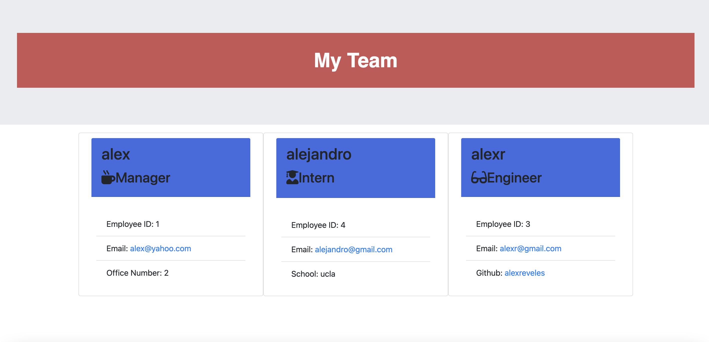

  ## Team profile Generator 
  #### https://github.com/alexreveles
  ## Description
  Creating a manager to lead a team of engineers and intern to complete any coding task needed.
  ##  Table of Contents
  * [Installation](#installation)
  * [Usage](#usage)
  * [License](#License)
  * [Contributing](#contributing)
  * [Tests](#Tests)
  * [Questions](#questions)
  ## Installation
  The dependencies are necessary to be installed to be able to run the application. git init -y, npm inquirer, npm jest.
  ## Usage
  In order to run this application, This application is run in your terminal following a prompt a questions and choosing your team.
  
  # License
  This project is  licensed MIT license.
  
  ## Contributing
  Contributors: Alex Reveles
  ## Test
  The following is needed to run the test: node index.js and npm run test.
  ## Questions
  If you have any questions regarding about the application, please contact me alexreveles@yahoo.com

### https://youtu.be/YmET3YOy1hc
### https://github.com/alexreveles/professional-README-generator/blob/main/README.md
### https://github.com/alexreveles

